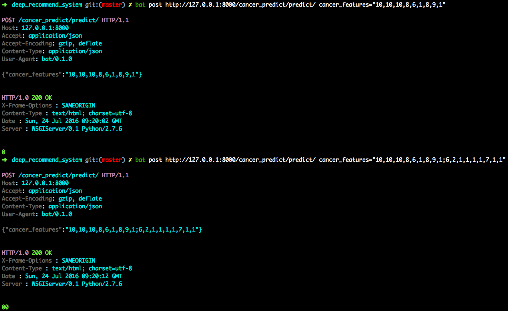

# Cancer Predictiton Service

This is the HTTP service to load TensorFlow model and inference to predict cancer.

## Usage


Run HTTP server with [Django] and use HTTP client with curl, postman or [bat](https://github.com/astaxie/bat) for test.

```
./manage.py runserver 0.0.0.0:8000
```

### Inference to predict cancel

```
bat post http://127.0.0.1:8000/cancer_predict/predict/ cancer_features="10,10,10,8,6,1,8,9,1;6,2,1,1,1,1,7,1,1"
```



### Online learning to train

```
bat post http://127.0.0.1:8000/cancer_predict/online_train/ cancer_features_and_labels="10,10,10,8,6,1,8,9,1,1;6,2,1,1,1,1,7,1,1,0"
```


## Implementation

```
django-admin startproject restful_server

python manage.py startapp cancer_predict

# Add customized urls and views.
```
